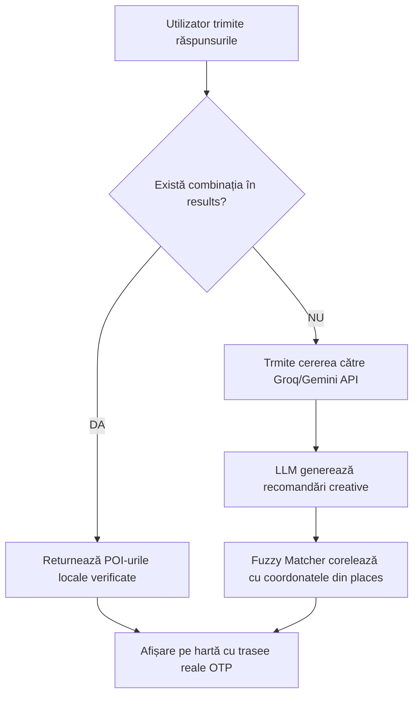

# 🏔️ Ghid de Integrare a Arborelui de Decizie JSON cu Serviciul AI

Acest document reprezintă ghidul tehnic complet pentru dezvoltatori, explicând cum să integreze baza de date locală de recomandări (`decision_tree.json`) cu motoarele de Inteligență Artificială (Groq/Gemini LLMs). 

Scopul acestei integrări este de a asigura o experiență hibridă premium: **viteză instantanee și cost zero** pentru combinațiile cunoscute, dublate de **flexibilitatea și creativitatea LLM-ului** pentru cererile atipice sau dinamice, păstrând în același timp precizia datelor geografice reale (coordonate GPS verificate).

---

## 1. 📊 Structura Fișierului `decision_tree.json`

Fișierul [`decision_tree.json`](file:///c:/Users/user/Desktop/SmartCity/public/decision_tree.json) este structurat pe categorii principale (ex: `natura`, `arta`, `restaurante`). Fiecare categorie conține trei piloni fundamentale:

```json
{
  "natura": {
    "categoryId": "natura",
    "categoryLabel": "Natură",
    "categoryIcon": "leaf",
    "questions": [
      {
        "id": "q1",
        "text": "Ce nivel de activitate preferi?",
        "options": [
          { "id": "a", "label": "Relaxat – plimbări, natură", "icon": "leaf" }
        ]
      }
    ],
    "places": {
      "tampa": {
        "name": "Muntele Tâmpa",
        "description": "Rezervație naturală unică chiar în inima orașului...",
        "tip": "Urcă cu telecabina și coboară pe jos pe drumul serpentinelor.",
        "coordinates": { "lat": 45.6372, "lng": 25.5925 }
      }
    },
    "results": {
      "a-a-a": {
        "recommendations": ["tampa"]
      }
    }
  }
}
```

### Elementele Cheie ale Structurii:
1. **`questions`**: Definește ierarhia de întrebări și identificatorii opțiunilor (`id`-uri scurte precum `a`, `b`, `c`).
2. **`places`**: Baza de date centralizată cu punctele de interes (POI) verificate din Brașov, conținând denumirea exactă, descrierea, sfatul practic (`tip`) și coordonatele geografice precise.
3. **`results`**: O hartă de corespondență (lookup dictionary) între o cheie de combinație (ex: `a-b-c`) și o listă de ID-uri de locații din `places`.

---

## 2. 🏗️ Strategii de Integrare pe Partea de AI (LLM)

Pentru a exploata la maximum datele locale împreună cu un model lingvistic de mari dimensiuni (LLM), se recomandă aplicarea a **trei arhitecturi complementare**:

### Arhitectura A: Router Hibrid (Local-First)
Aceasta este cea mai eficientă metodă implementată în frontend-ul aplicației. Sistemul încearcă mai întâi un lookup local pe baza ID-urilor de răspuns. Dacă cheia există în `results`, returnează datele instantaneu. În caz contrar, deleagă cererea către LLM.

#### Schema de Rulare:


---

### Arhitectura B: Prompt Grounding (Ancorarea LLM-ului)
Când lăsăm modelul AI să genereze liber recomandări, există riscul de halucinație (inventarea de locații sau tip-uri greșite). Pentru a preveni acest lucru, putem injecta opțiunile verificate din `places` direct în contextul Promptului transmis către API (tehnică similară cu RAG).

#### Exemplu de Prompt Structurat pentru API:
```javascript
const categoryData = decisionTree[catId];
const verifiedPlacesList = Object.values(categoryData.places)
  .map(p => `- ${p.name}: ${p.description}`)
  .join('\n');

const prompt = `
  Ești un ghid turistic expert în Brașov. Utilizatorul a ales opțiunile: ${userAnswersJoin}.
  
  Optează în primul rând pentru selectarea și personalizarea recomandărilor din lista noastră de locații verificate de mai jos:
  ${verifiedPlacesList}
  
  Dacă niciuna nu corespunde perfect profilului, poți recomanda o locație nouă reală, dar asigură-te că respecți formatul JSON cerut.
`;
```

---

### Arhitectura C: Rezoluția Entităților și Ancorarea Geografică (Fuzzy Matching)
Când modelul AI returnează text liber (de exemplu, returnează `"Tampa"` sau `"Muntele Tampa"`), coordonatele geografice nu sunt prezente. Frontend-ul rulează un algoritm de potrivire fuzzy pentru a corela răspunsul AI cu baza locală `places` pentru a prelua coordonatele exacte.

#### Cod de Implementare TypeScript:
```typescript
import { Levenshtein } from 'some-utils'; // sau orice algoritm de potrivire

export function findVerifiedCoordinates(generatedName: string, categoryPlaces: any) {
  const clean = (s: string) => s.toLowerCase().replace(/[^a-z0-9]/g, '');
  const target = clean(generatedName);
  
  let bestMatch = null;
  let highestScore = 0;

  for (const key of Object.keys(categoryPlaces)) {
    const place = categoryPlaces[key];
    const placeClean = clean(place.name);
    
    // Potrivire exactă sau incluziune reciprocă
    if (placeClean.includes(target) || target.includes(placeClean)) {
      return place.coordinates;
    }
    
    // Calcul de similaritate
    const score = calculateSimilarity(placeClean, target); // scor între 0 și 1
    if (score > highestScore && score > 0.75) {
      highestScore = score;
      bestMatch = place;
    }
  }
  
  return bestMatch ? bestMatch.coordinates : null;
}
```

---

## 3. 🚀 Ghid de Implementare Pas cu Pas în Backend (Node.js/Express)

Dacă doriți să mutați logica de decizie complet în backend-ul de Node.js (`pwa-bridge.js`), iată structura completă a endpoint-ului recomandat:

```javascript
const fs = require('fs');
const path = require('path');

// Încărcarea arborelui la pornire
const treePath = path.resolve(__dirname, '../public/decision_tree.json');
let decisionTree = {};
if (fs.existsSync(treePath)) {
    decisionTree = JSON.parse(fs.readFileSync(treePath, 'utf8'));
}

app.post('/api/v1/ai/recommendation/hybrid', async (req, res) => {
    const { category, answers, combinationKey } = req.body;
    const catId = category.toLowerCase();
    
    const catTree = decisionTree[catId];
    if (catTree) {
        // 1. Încercare lookup local rapid
        const localResult = catTree.results[combinationKey];
        if (localResult) {
            const mapped = localResult.recommendations.map(id => catTree.places[id]).filter(Boolean);
            console.log(`[Hybrid AI] Servit din cache local pentru combinația: ${combinationKey}`);
            return res.json({ source: 'local', recommendations: mapped });
        }
    }
    
    // 2. Fallback pe Modelul Generativ (Groq/Gemini) cu ghidaj contextual
    try {
        const verifiedNames = catTree ? Object.values(catTree.places).map(p => p.name).join(', ') : '';
        const systemPrompt = `
          Ești un ghid local din Brașov. Recomandă exact 3 locuri. 
          Încearcă să alegi de preferință din aceste locații cunoscute: [${verifiedNames}].
          Returnează DOAR un obiect JSON valid cu formatul: 
          { "recommendations": [ { "name": "Nume", "description": "Descriere", "tip": "Sfat" } ] }
        `;
        
        const response = await queryLLM(systemPrompt, answers);
        const generated = JSON.parse(response);
        
        // Atașează coordonatele prin fuzzy matching
        const enriched = generated.recommendations.map(rec => {
            const coords = findFuzzyCoords(rec.name, catTree ? catTree.places : {});
            return { ...rec, coordinates: coords };
        });
        
        res.json({ source: 'ai', recommendations: enriched });
    } catch (err) {
        console.error('[AI Hybrid Fallback Error]', err.message);
        // Fallback extrem: returnăm primele 3 din categoria respectivă ca să nu crape UI-ul
        const extremeFallback = Object.values(catTree.places).slice(0, 3);
        res.json({ source: 'extreme-fallback', recommendations: extremeFallback });
    }
});
```

---

## 4. 💡 Bune Practici

1. **Sincronizare continuă**: De fiecare dată când se adaugă un POI nou în frontend (pe hartă), asigurați-vă că ID-ul și coordonatele sale sunt adăugate în secțiunea `"places"` corespunzătoare din `decision_tree.json`.
2. **Standardizarea denumirilor**: Denumirile folosite în prompturile AI și în fișierul JSON trebuie să fie identice cu cele de pe Google Maps pentru a asigura o rutare OTP perfectă la apăsarea butonului `RUTĂ`.
3. **Validare JSON schema**: La build-ul aplicației, rulați un script simplu de validare pentru a vă asigura că niciun rezultat din `results` nu face referire la un ID de locație absent din `places`.
